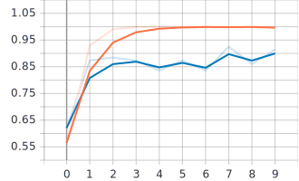
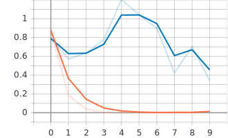

## Rock paper scissors Game

> Web-based game that is using ML and CV classify your shape selection.

## Table of contents

- [Screenshots](#screenshots)
- [Technologies](#technologies)
- [Setup](#setup)
- [Status](#status)
- [Contact](#contact)

## Accuracy and Loss chart





## Technologies

Project is created with:

- Python
- TensorFlow
- Keras
- OpenCV-python
- Flask
- Rest of the libraries versions are saved in requirements.txt

## Setup

### To run this project:

First of all make sure that you have Python version 3.6.6 installed on your machine.
Prepare virtual environment, for example with:

- pyenv (https://github.com/pyenv/pyenv-virtualenv)
- conda (https://docs.conda.io/projects/conda/en/latest/user-guide/concepts/environments.html)
- venv (https://packaging.python.org/guides/installing-using-pip-and-virtual-environments/)

After creating and running your virtual environment make sure that your 'pip' package installer is working. Check its version for a test and if needed update it:

```
$ pip --version
$ pip install --upgrade pip
```

Now time to install all the requirements like TensorFlow, Keras etc. :

```
$ cd ../'project folder'
$ pip install -r requirements.txt
```

If all the requirements has been installed time to run our application!

```
$ python index.py
```

## Status

Project is: _in progress_

## Contact

Created by Stanislaw Polichnowski

## Credits to

http://www.laurencemoroney.com/rock-paper-scissors-dataset/
